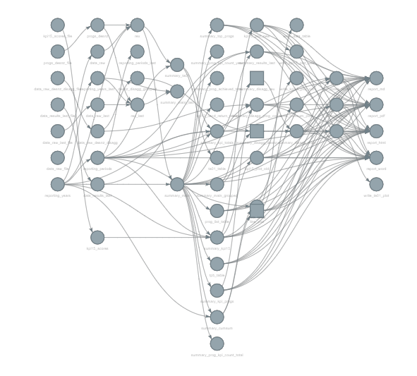

# International Climate Finance Results: Pipeline
----

## Background
This repository contains the pipeline used for producing the UK Government's International Climate Finance (ICF) Results publication. It will generate the summary statistics, plots, tables and report as they appear on the [ICF Results webpage](https://www.gov.uk/guidance/uk-international-climate-finance-results).

Results for the ICF portfolio are collected, aggregated, and published annually. ICF Results are not Official or National statistics. This is because of the range of data sources we use and their variable quality, which are affected by the challenging environments where we work. Yet, we and our partners strive to apply data quality best practices and we voluntarily follow the [Code of Practice for Statistics](https://code.statisticsauthority.gov.uk/voluntary-application/) in the production of ICF results.

Please contact [statistics@fcdo.gov.uk](mailto:statistics@fcdo.gov.uk) if you have any suggestions, questions or comments.

## Releases
This is the first publication of the ICF Results pipeline and corresponds to the 2023 ICF results publication. Each subsequent pipeline release will correspond to a specific release of the ICF results publication.

Each pipeline release is registered with a unique, and persistent, Digital Object Identifier (DOI).

Results Publication Date | Results Publication Release | Pipeline DOI   
----- | ----- | -----    
28 September 2023 | [2023 UK Climate Finance Results](www.gov.uk/government/publications/uk-climate-finance-result-2023) |  

## Overview
The bulk of the pipeline handles and aggregates results data reported by ICF programmes against a set of Key Performance Indicators (KPIs).  HMG analysts and ICF delivery partners input data to the [Results Evidence and eXchange](https://rex.fcdo.gov.uk/) platform, which are then subject to several rounds of Quality Assurance (QA). Once results have passed the QA process, they are ready to be processed in the pipeline. For further information about ICF Results and how they are calculated see the [ICF Results webpage](https://www.gov.uk/guidance/uk-international-climate-finance-results).

The pipeline is built in R using the [{targets}](https://docs.ropensci.org/targets/) package. The `_targets.R` script is the heart of a target pipeline. It defines each of the pipeline targets and sets out the general workflow. Once the repository is downloaded, the R environment to run the pipeline (packages, their versions and dependencies, and some environment variables) can be replicated from the `renv.lock` file using `renv::restore()`. Then, to execute the pipeline simply run `targets::tar_make()`, which will launch a fresh R process and build the targets.  If successful, all targets will be cached in the `_targets/` store and will be overwritten whenever upstream targets, on which there is a dependency, are altered. 

> **NOTE:** this pipeline cannot be run without the relevant datasets outlined in the [Data](#2-Data) section of this document, which have not been shared publicly due to the sensitive nature of programme-level results.

To better understand the pipeline, we briefly describe aspects of the workflow particular to our project and data below. Here is an image of the dependency graph of the pipeline targets and how they interconnect.

### 1. Setup
The front matter of the `_targets.R` control file sources the packages and functions required, loads relevant fonts (including proprietary fonts for gov.uk) and sets some environment options. The targets plan is then executed, where individual pipeline targets are built.

### 2. Data
<ol type ="a">

<li>The pipeline begins by reading in the latest data from the Results Evidence and eXchange platform (REX), and a cut of the data from the previous year. These files contain programme level results data, including disaggregated data, for each programme and KPI. We also read in last year's published results to calculate historic revisions. </li>

<li>Currently, disaggregated data can only be reported on REX where the breakdowns sum to the total KPI result. Therefore, programmes that can only disaggregate their total results for an indicator by one disaggregation variable at a time, need to be read in separately and later joined with the disaggregated data recorded within REX.</li>

<li>Finally, we read in a set of scores for KPI 15, which contains an aggregate score for each year across the four merged Climate Investment Funds (CIFs) as well as occurrences of true 0 scores reported by programmes under the old scoring system.</li>

</ol>

### 3. Tidying and filtering
<ol type ="a">

<li> To transform the data into useful summaries, it must be tidied. Columns names and data values are cleaned and TA KPI 2 is separated into 2.1 and 2.2 to distinguish individuals from organisations. The four sub funds under the CIFs are also merged under one Programme ID.</li>

<li>Results data from the previous year are also tidied in the same way as the latest data.</li>

</ol>

### 4. Tests
As an additional QA step, we run several data validation tests to ensure inputters of data into REX have not accidentally inputted results data into future reporting years, duplicate records haven't accidentally been created, check KPI15 scores are valid, and that planned results have been updated for the current reporting year. 

### 5. Transform
The tidied data is transformed into various summary tables. These summaries are used for quality assurance, internal reporting and dashboards, and ultimately feed directly into the ICF results publication.

### 6. Tables
Indicator data are formatted into tables to be rendered in the publication, and so information on KPIs can be easily coded into the RMarkdown file as inline code chunks e.g. the number of programmes reporting.

### 7. Plots
Plots are generated from the summarised data and are both directly loaded from the targets cache into the RMarkdown report and written to disk as SVGs. These plots include a time series for the cumulative achieved results of each KPI, bar charts to display the distribution of KPI 15 scores, and a map for TA KPI 1 to display the countries ICF programmes have supported through technical assistance.

### 8. Write
<ol type ="a">

<li>The table of cumulative results by KPI, which accompanies the publication, is output to CSV.</li>

<li>Plots are saved in SVG (Scalable Vector Graphics) format as this is the preferred format for publishing on gov.uk. </li>

</ol>

### 9. Render
The ICF Results publication is rendered in Markdown and PDF ready for publication on [gov.uk](www.gov.uk), as well as Word for internal review. Data, plots, and tables are pulled directly into the R markdown from the targets cache, ensuring any changes to the data or pipeline are reflected in the final report. 

 
